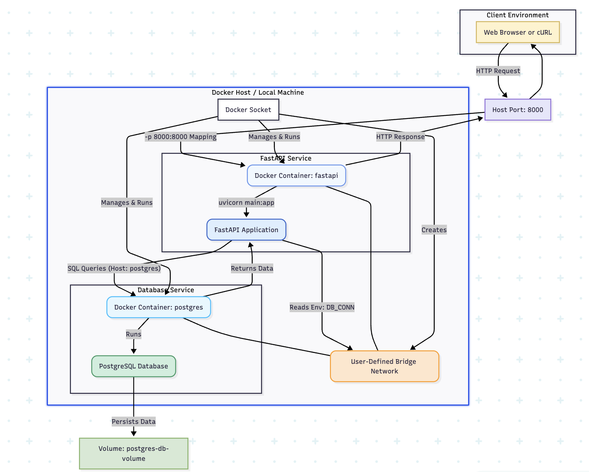

# Intro to APIs and Docker

This repo contains a [notebook](01-intro-to-json.ipynb) explaining how you can work with JSON data. Then there is are a few markdown files explaining how you can create a simple API with FastAPI and how you can use Docker to containerize your API.

1. Small introduction to Docker and how to spin up a local database with it. [Intro to docker](02-intro-to-docker.md)
2. Introduction to FastAPI and how to create a simple API. [Intro to FastAPI](03-intro-to-fastapi.md)
3. Introduction to Docker and how to containerize your API. [Intro to Docker](04-intro-to-docker.md)
4. Introduction to Docker Compose and how to spin up your API and a local database with it. [Intro to Docker Compose](05-intro-to-docker-compose.md)

### Environment

You can find the requirements file in the **/service** directory. Use this file to create a new environment for this task.


#### **`macOS`**
```BASH
pyenv local 3.11.3
python -m venv .venv
source .venv/bin/activate
pip install --upgrade pip
pip install -r service/requirements.txt
pip install jupyter
```
#### **`WindowsOS`**
For `PowerShell` CLI :

```PowerShell
pyenv local 3.11.3
python -m venv .venv
.venv\Scripts\Activate.ps1
python -m pip install --upgrade pip
pip install -r service/requirements.txt
pip install jupyter
```

For `Git-Bash` CLI :

```
pyenv local 3.11.3
python -m venv .venv
source .venv/Scripts/activate
pip install --upgrade pip
pip install -r service/requirements.txt
pip install jupyter
```

### Setup

- You need to install **Docker** for this task. Please **install the Desktop version** (for MacOS with M1/M2 chips there is no alternative). You can find the installation instructions [**here**](https://docs.docker.com/get-docker/).

- Also you need to install `psql` to interact with the database. 

#### **`macOS`**
```sh
brew install postgresql@17

# To start services
brew services start postgresql@17

# To stop
brew services stop postgresql@17
```

In case `psql` doesn't work:
```sh
brew install libpq
brew link --force libpq
```

#### **`WindowsOS`**
Please follow the installation instructions [here](https://www.w3schools.com/postgresql/postgresql_install.php).

### Diagram
When you are done with the exercise this is the structure you will have created. 